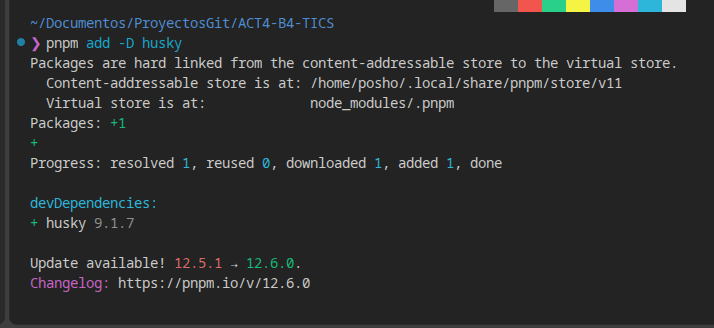
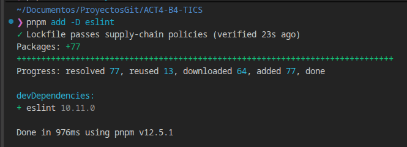
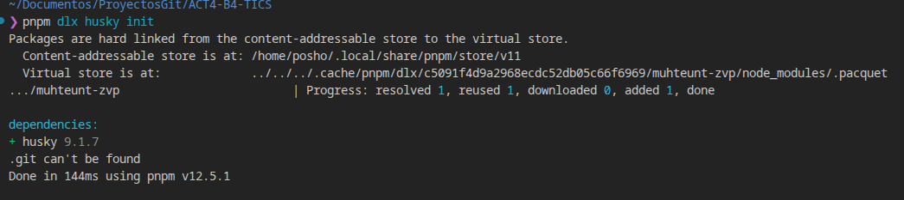
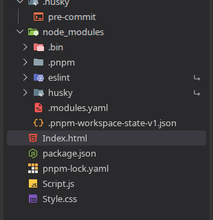
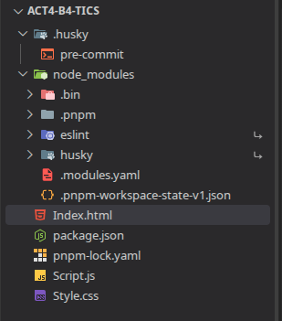
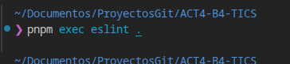

# Mini App - Catálogo de Productos

Mini aplicación web que consume una API pública, muestra los datos dinámicamente
en pantalla y permite una interacción básica de búsqueda y filtrado. El proyecto
incluye control de calidad de código con **ESLint** y un **pre-commit hook**
configurado con **Husky**.

## Estructura del proyecto

```
mini-app-productos/
├── index.html
├── script.js
├── style.css
├── package.json
├── eslint.config.js
├── .gitignore
└── .husky/
    └── pre-commit
```

## Funcionalidad

- **Consumo de API pública**: se usa `fetch()` para obtener datos desde
  `https://fakestoreapi.com/products`.
- **Renderizado dinámico**: los productos se pintan en el DOM como tarjetas
  (imagen, nombre, precio y categoría) usando `document.createElement`.
- **Interacción básica**:
  - Campo de búsqueda por nombre de producto (filtra en tiempo real).
  - Selector de categoría (se llena dinámicamente según los datos recibidos).
  - Botón "Recargar datos" que vuelve a hacer la petición a la API.
- **Manejo de errores**: si la petición falla, se muestra un mensaje de estado
  en pantalla en lugar de romper la app.

## Proceso realizado

1. Se crearon los archivos base del proyecto: `index.html`, `script.js` y
   `style.css`.
2. Se desarrolló la mini app de productos:
   - Obtención de datos con `fetch()`.
   - Renderizado dinámico en pantalla.
   - Interacción mediante búsqueda y filtro por categoría.
3. Se inicializó el repositorio con `git init`.
4. Se agregó `husky` y `eslint` como dependencias de desarrollo
   (`npm install husky eslint --save-dev`).
5. Se inicializó Husky (`npx husky init`), lo que generó la carpeta `.husky/`.
6. Se configuró ESLint (`eslint.config.js`, formato flat config para
   ESLint 9+) con reglas básicas de estilo (uso de `const`/`let`, punto y coma
   obligatorio, comillas dobles, comparación estricta, etc.).
7. Se configuró el hook `.husky/pre-commit` para que ejecute `npx eslint .`
   antes de cada commit. Si ESLint encuentra errores, el commit se cancela.
8. Se verificó que Husky bloquea los commits cuando hay errores de estilo
   (ver sección "Cómo probarlo" abajo).

## Instalación y uso

> Este proyecto requiere conexión a internet para instalar las dependencias
> de Node y para que la app consuma la API pública.

```bash
# 1. Instalar dependencias (esto también deja Husky listo gracias al script "prepare")
npm install

# 2. Ejecutar ESLint manualmente si se desea
npm run lint

# 3. Abrir index.html en el navegador (o usar la extensión Live Server de VSC)
```

## Cómo probar que Husky bloquea los commits con errores de estilo

1. Edita `script.js` e introduce un error de estilo a propósito, por ejemplo
   quita un punto y coma o usa `var` en lugar de `const`.
2. Ejecuta:
   ```bash
   git add .
   git commit -m "prueba de husky"
   ```
3. ESLint debe reportar el error y el commit **no se completa**.
4. Corrige el error, vuelve a hacer `git add .` y el commit se realiza sin
   problema.

## Capturas de pantalla

### Instalación de dependencias con pnpm

**Instalación de Husky**


**Instalación de ESLint**


**Inicialización de Husky**


### Estructura del proyecto





### Ejecución de ESLint



## Notas

- API pública utilizada: [Fake Store API](https://fakestoreapi.com/products).
- El hook de Husky corre `npx eslint .`, así que basta con tener las
  dependencias instaladas (`npm install`) para que funcione.